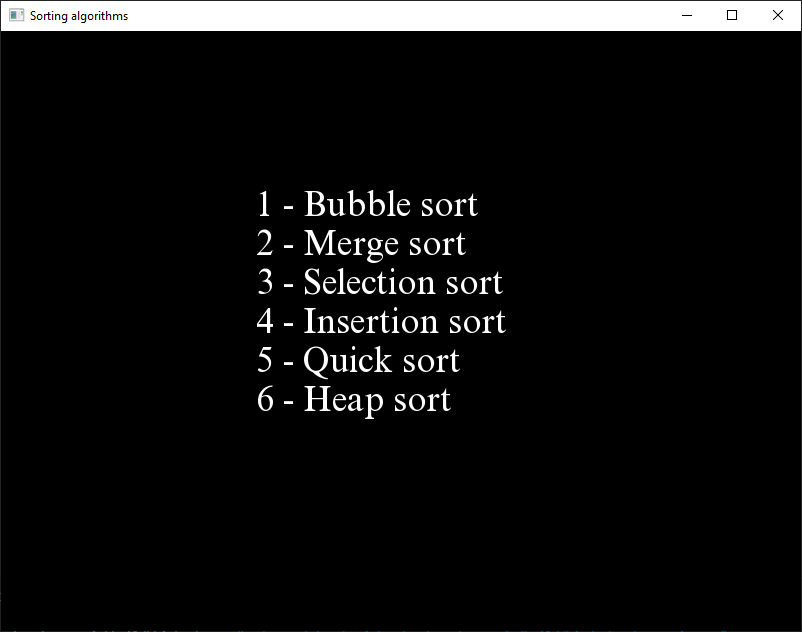
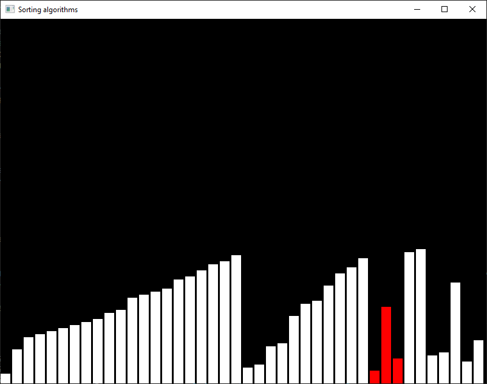

# SortingAlgorithmsVisualized

In this project I use SFML with C++ to visulize some of the most common soring algorithms.

## Sorting algorithms

- Bubble sort
- Insertion sort
- Quick sort
- Merge sort
- Heap sort
- Selection sort

## Screenshots

